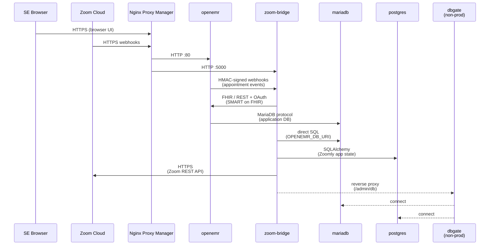
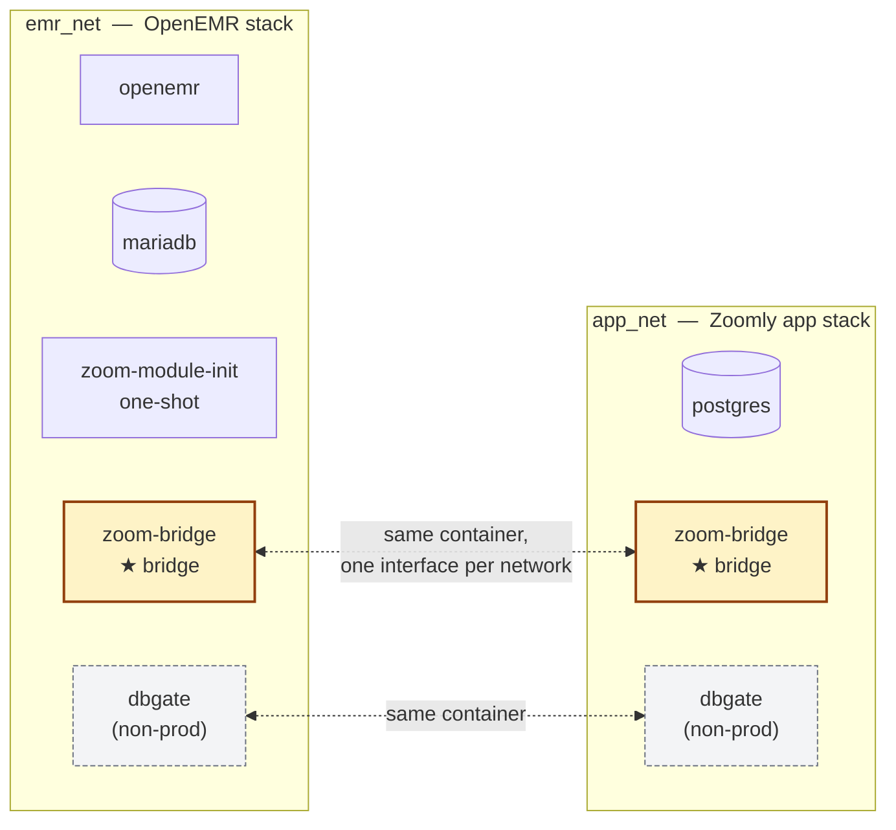
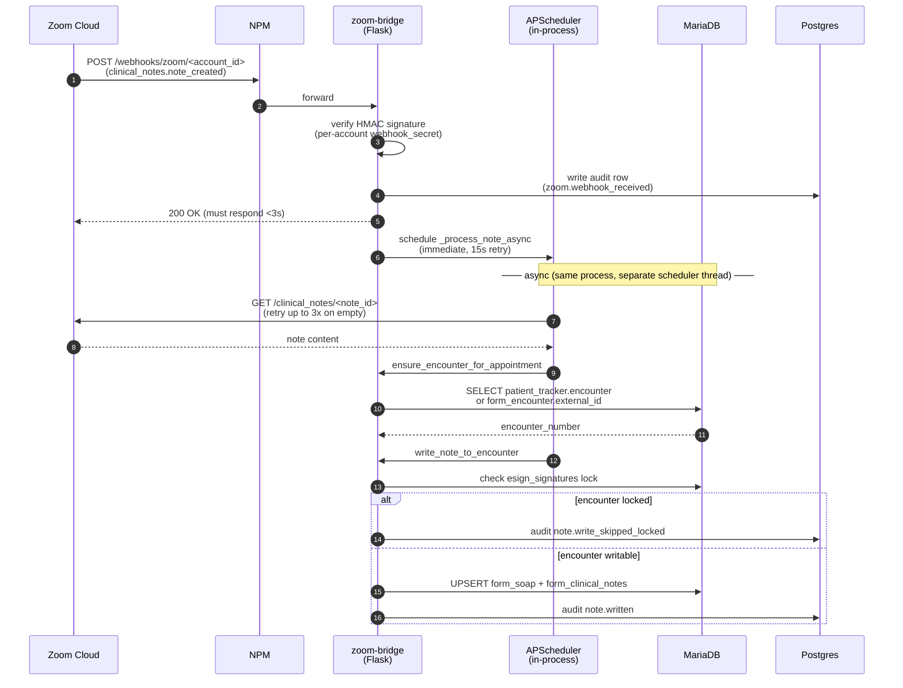
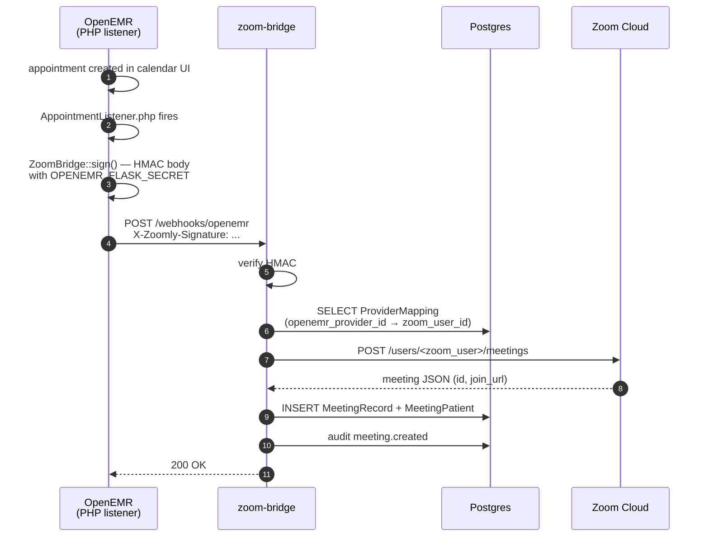

# Zoomly — Architecture & Deployment Handoff

> Scope: documents the **current docker-compose state** (dev + staging) as of
> Sprint 13.

---

## 1. What Zoomly is, in one paragraph

Zoomly is a sandbox demo Electronic Health Record (EHR) environment that
integrates Zoom solutions (meetings and clinical notes; ZCC/ZVA on the
roadmap) with OpenEMR 8.0.0 via a Python Flask middleware application `zoom-bridge`. It is **not a production clinical system** though it is a modified version of OpemEMR which is an open source production capable EHR, typically for smaller practices or clinics — it
powers SE-led demos showcasing real EHR + telehealth workflows. The stack
runs as a single instance per demo deployment. Internal services are segmented
across two Docker bridge networks.

---

## 2. System overview

This is a **catalog of every service-to-service connection**, not a
time-ordered sequence — for actual time-ordered request flows see §6.



Key shapes to internalize:

- **`zoom-bridge` is the integration core.** It speaks to Zoom (outbound API),
  OpenEMR (FHIR/REST + receives HMAC webhooks), MariaDB (direct SQL for
  queries OpenEMR's REST API doesn't cover), and Postgres (its own state).
  Most arrows in the diagram originate or terminate at `ZB`.
- **OpenEMR cannot reach Postgres.** No arrow exists between them — that's
  the primary blast-radius containment goal. An OpenEMR compromise must not
  have a TCP path to Zoomly's app database (Zoom credentials, OAuth tokens,
  audit log, encryption-at-rest key material). Enforced by network
  segmentation (§4).
- **DbGate is non-prod only.** Dashed arrows mark its paths. In prod it's
  not started, the Flask `/admin/db` proxy is unregistered, and the React UI
  hides the nav entry (§13).
- **`zoom-module-init`** is a one-shot container that runs during stack
  startup and exits. Omitted from this diagram — it has no runtime data flow.
  (The previous `branding` init container was retired when patches + branding
  were baked into the custom OpenEMR image built from `openemr/Dockerfile`.)

---

## 3. Service inventory

| Service            | Image                          | Long-lived? | Host port   | Restart          | Network attachments  | Role                                                                                          |
| ------------------ | ------------------------------ | ----------- | ----------- | ---------------- | -------------------- | --------------------------------------------------------------------------------------------- |
| `mariadb`          | `mariadb:11.4`                 | yes         | none        | `unless-stopped` | `emr_net`            | OpenEMR's relational store                                                                    |
| `openemr`          | `zoomly-openemr:local` (built from `openemr/Dockerfile` `FROM openemr/openemr:8.0.0`) | yes | `8300:80` | `unless-stopped` | `emr_net` | EHR application (PHP + Apache); patches + branding baked into the image |
| `zoom-module-init` | `alpine:latest`                | no (exits)  | none        | `no`             | `emr_net`            | One-shot — inserts the ZoomAppointmentListener row into the `modules` MariaDB table           |
| `postgres`         | `postgres:16`                  | yes         | none        | `unless-stopped` | `app_net`            | Zoomly app DB (accounts, meetings, notes, audit log)                                          |
| `dbgate`           | `dbgate/dbgate`                | yes         | none        | `unless-stopped` | `app_net`, `emr_net` | **Non-prod only** (compose profile `non-prod`). Web DB browser, reverse-proxied through Flask |
| `zoom-bridge`      | built from `server/Dockerfile` | yes         | `5000:5000` | `unless-stopped` | `emr_net`, `app_net` | Flask integration server + React static assets + APScheduler                                  |

### Host ports

| Host    | Reaches                       |
| ------- | ----------------------------- |
| `:8300` | OpenEMR Apache (`openemr:80`) |
| `:5000` | Flask (`zoom-bridge:5000`)    |

Both host ports are intentional: NPM terminates TLS on a separate machine and
upstreams to these. **No database ports are mapped to the host.** MariaDB and
Postgres are reachable only over their respective internal networks.

---

## 4. Network topology

Two Docker bridge networks. `zoom-bridge` is the only service attached to
both — it's the legitimate bridge between OpenEMR's stack and Zoomly's app
stack. Every other service belongs to exactly one network.



The dashed line between the duplicate `zoom-bridge` (and `dbgate`) nodes
indicates they are the **same container** — Docker assigns one network
interface per attached bridge network, so a container with two network
attachments shows up as a member of both. This isn't two instances of the
service; it's one instance with two IP addresses.

### Membership matrix

| Service                   | `emr_net` | `app_net` |
| ------------------------- | :-------: | :-------: |
| `openemr`                 |     ✓     |           |
| `mariadb`                 |     ✓     |           |
| `zoom-module-init` (init) |     ✓     |           |
| `zoom-bridge`             |     ✓     |     ✓     |
| `dbgate` (non-prod)       |     ✓     |     ✓     |
| `postgres`                |           |     ✓     |

### What each network does

| Network   | Members                                                                           | Excludes   | Purpose                                                                                                                           |
| --------- | --------------------------------------------------------------------------------- | ---------- | --------------------------------------------------------------------------------------------------------------------------------- |
| `emr_net` | `openemr`, `mariadb`, `zoom-bridge`, `dbgate` (non-prod), `zoom-module-init` (init) | `postgres` | OpenEMR ↔ MariaDB SQL, OpenEMR ↔ zoom-bridge HTTP (FHIR/REST + webhooks), zoom-bridge direct MariaDB queries via `OPENEMR_DB_URI` |
| `app_net` | `postgres`, `zoom-bridge`, `dbgate` (non-prod)                                    | `openemr`  | Zoomly app DB access from zoom-bridge; non-prod DB browsing                                                                       |

### Why the segmentation matters

The **only** thing this design enforces over a single-network model is that
**`openemr` has no TCP path to `postgres`**. That's the load-bearing
guarantee — Postgres holds Zoom OAuth tokens, audit logs, and the
`ENCRYPTION_KEY`-derived ciphertexts for every stored secret. Keeping it off
`emr_net` means a compromised OpenEMR can't pivot to it directly.

OpenEMR ↔ zoom-bridge HTTP and OpenEMR ↔ MariaDB SQL both share `emr_net`
because there's no security value in splitting them at the Docker layer.

---

## 5. External traffic & TLS

The full inbound path is **client → Cloudflare → NPM → container**. Two
distinct TLS terminations and two different cert lifecycles.

```
                           Cloudflare (proxied / orange-cloud)
client  ──HTTPS──►  edge ── HTTPS ──►  NPM  ── HTTP ──►  openemr / zoom-bridge
                   (edge cert,         (origin cert,       (host port :8300 / :5000)
                    Cloudflare-managed) Let's Encrypt
                                        via DNS challenge)
```

**Cloudflare** (`theloosemoose.us`) is the authoritative DNS provider for the
domain *and* runs in proxied mode (orange-cloud) for the Zoomly hostnames.
That means Cloudflare's edge terminates the public TLS connection, applies
WAF / DDoS / rate-limiting at the edge, and then forwards traffic over HTTPS
to NPM at the origin. Cloudflare manages the public-facing cert (the one
browsers see); operators don't touch it.

**Nginx Proxy Manager** runs on a separate physical box (or VLAN) — **not in
the compose stack** — and is shared by other demo/internal services. NPM
terminates the second TLS hop using Let's Encrypt origin certs (DNS
challenge) and proxies HTTP to the container host ports. Without proxied
Cloudflare in front, NPM would be the only termination point and would face
the public internet directly; the current setup means NPM only ever sees
Cloudflare's edge IPs.

Implications worth knowing:

- **Two cert renewals** to keep alive (Cloudflare's edge cert is automatic;
  NPM's Let's Encrypt origin cert runs on NPM's own cron).
- **Real client IP** doesn't reach the container natively. NPM should be
  configured to read `CF-Connecting-IP` (or `X-Forwarded-For`) so audit logs
  show actual client IPs rather than Cloudflare's edge IPs. Today the
  `jwks.fetched` audit event reads `X-Forwarded-For` so the chain works
  through both proxies.
- **Cloudflare is a hard dependency for public access** — taking the
  hostnames out of proxied mode and pointing them straight at NPM's public IP
  would also work, but the current operational posture assumes Cloudflare is
  present.

| Public hostname (dev / staging)                                             | Upstreams to                                                                                                                                        |
| --------------------------------------------------------------------------- | --------------------------------------------------------------------------------------------------------------------------------------------------- |
| `openemr-dev.theloosemoose.us` / `openemr-staging.theloosemoose.us`         | `openemr:80` on host port `:8300`                                                                                                                   |
| `zoom-bridge-dev.theloosemoose.us` / `zoom-bridge-staging.theloosemoose.us` | `zoom-bridge:5000` on host port `:5000`                                                                                                             |
| _(none for dbgate)_                                                         | DbGate is never NPM-exposed. Internal access is via the Flask reverse proxy at `/admin/db`, which itself is gated behind the React app's JWT login. |

The `OPENEMR_PUBLIC_URL` env var on `zoom-bridge` carries the public hostname
— it's used only for OAuth2 `aud` claims and outbound URLs to Zoom (so Zoom
knows where to send webhooks). All OpenEMR API calls **inside** Docker use
the internal `http://openemr:80`, never the public URL — this is load-bearing
because OpenEMR's OAuth library validates `aud` strictly and a public-URL
internal call would mismatch.

---

## 6. Critical data flows

### 6a. Zoom webhook → clinical note write (the hot path)

This is the demo-critical path. A clinician finishes a Zoom telehealth visit,
Zoom posts a webhook to Flask, Flask fetches the note from Zoom and writes it
into the OpenEMR encounter.



Notes:

- The webhook URL is **per-account** (`/webhooks/zoom/<account_id>`) because
  CRC URL validation carries no account_id in the payload; the path is the
  only signal during CRC.
- The 200 response is returned _before_ note fetching starts — Zoom's
  webhook timeout is 3 seconds and clinical note fetches can take longer.
- APScheduler runs in-process within Gunicorn. **This is why `zoom-bridge`
  must run as a single replica** — see §9.
- All side effects on the OpenEMR side go through direct MariaDB SQL, not
  through OpenEMR's REST/FHIR API. The OAuth/JWKS flow is used for OpenEMR's
  side calls (FHIR Patient lookups, appointment lookups) but writing forms
  uses raw SQL because the FHIR API doesn't cover SOAP / Clinical Notes forms.

### 6b. OpenEMR appointment created → Zoom meeting created



For `appointment.deleted`, the corresponding meeting is removed from Zoom;
the local `MeetingRecord` is either deleted (no clinical note exists) or
marked `cancelled` (clinical note exists — retained for audit). The
distinction is enforced at the application layer: any `ClinicalNoteRecord`
present represents real chart data that should never be silently cleaned up.
A `ON DELETE CASCADE` on `clinical_note_records.zoom_meeting_id` is a safety
net at the DB layer for any future raw-delete path.

---

## 7. Persistent state

Three categories. The first is runtime data, the second is code/config
shipped to OpenEMR via bind mount, the third is application logs.

### 7a. Named volumes (real runtime state)

| Volume           | Container path                                     | Contents                                                                                                                                        | Blast radius if lost                                                        |
| ---------------- | -------------------------------------------------- | ----------------------------------------------------------------------------------------------------------------------------------------------- | --------------------------------------------------------------------------- |
| `db_data`        | `mariadb:/var/lib/mysql`                           | OpenEMR's MariaDB datafiles — every patient, encounter, appointment, OAuth client registration                                                  | Total demo loss; re-seed required                                           |
| `postgres_data`  | `postgres:/var/lib/postgresql/data`                | Zoomly app DB — Zoom accounts, meeting records, clinical note records, audit log, provider mappings, encryption-at-rest keys for stored secrets | All Zoom integrations break; re-registration required for each account      |
| `openemr_sites`  | `openemr:/var/www/.../openemr/sites`               | OpenEMR's per-site config: SMART app registrations, uploaded patient docs, site-specific settings                                               | OAuth client registrations lost; SMART on FHIR breaks until re-registration |
| `openemr_logs`   | `openemr:/var/log`                                 | OpenEMR Apache + PHP error logs                                                                                                                 | Diagnostic data only — non-load-bearing                                     |

(The previous `openemr_public` named volume was retired when branding moved into the custom OpenEMR image — `openemr/Dockerfile` now lays the Zoom logos and favicon under `/var/www/.../openemr/public/images/logos/` at build time.)

### 7b. Bind mounts — code/config shipped to running containers

PHP patches and branding are baked into the custom OpenEMR image
(`openemr/Dockerfile`). In dev, the auto-loaded `docker-compose.override.yml`
re-introduces the `openemr/patches/` bind mounts to shadow the baked files for fast
iteration; `start-dev.sh --baked` skips the override entirely and runs the
baked image as it would behave in staging/prod. Staging and prod scripts pass
`-f docker-compose.yml` explicitly so they never see the override and are
always image-authoritative.

| Source (repo)         | Target (container)             | Purpose                                                                                                              |
| --------------------- | ------------------------------ | -------------------------------------------------------------------------------------------------------------------- |
| `./keys`              | `zoom-bridge:/app/keys`        | **Per-account RSA private keys** used for SMART on FHIR `private_key_jwt` assertions. Gitignored. Highly sensitive.  |
| `./server/logs`       | `zoom-bridge:/app/logs`        | Flask app logs (also written to stdout)                                                                              |
| `./server/migrations` | `zoom-bridge:/app/migrations`  | Alembic migration files                                                                                              |
| `./server/alembic.ini`| `zoom-bridge:/app/alembic.ini` | Alembic config                                                                                                       |

The full set of PHP files baked into the OpenEMR image is enumerated in
`openemr/Dockerfile`. Notable patches: `AuthorizationController.php` (DELETE
column-name fix), `RsaSha384Signer.php` (multi-client JWT kid lookup — see
`TD-02` in `CLAUDE.md`), the four `zoom_appointment_listener` module files,
and `library/zoomly/ZoomBridge.php` (shared HMAC signing helper).

### 7c. K8s notes on persistence

- `db_data`, `postgres_data`, `openemr_sites` → PVCs or managed DB (RDS/Cloud SQL). **DB hosting strategy is still open per the demo team** — managed-DB simplifies backup but loses bin-log access; in-cluster StatefulSets keep parity with current behavior. Either works.
- `openemr_logs`, `server/logs` → emptyDir is fine; logs go to stdout in K8s regardless.
- `keys/` (per-account RSA private keys) → **Secret material**. Mount from K8s Secrets (or ESO/Vault). Do not bake into image.
- PHP patches + branding → already baked into the custom OpenEMR image via `openemr/Dockerfile`; the K8s deploy just pulls the published image (once a Zoom-internal GitLab registry is selected).
- `server/migrations` → bake into the `zoom-bridge` image; `alembic upgrade head` runs as an init container or one-shot Job before pods start.

---

## 8. Configuration & secrets

`zoom-bridge` reads from `.env` (mounted via Compose `env_file`) plus explicit
`environment:` overrides. The other services receive specific values from
Compose interpolation against the host's `.env`.

### 8a. `zoom-bridge` — full env var inventory

Secrets are flagged. Everything else is operational config.

#### Database & service URLs

| Var                                   | Example value                                    | Sensitive?        | Purpose                                     |
| ------------------------------------- | ------------------------------------------------ | ----------------- | ------------------------------------------- |
| `DATABASE_URL`                        | `postgresql+psycopg2://...@postgres:5432/zoomly` | yes (contains pw) | SQLAlchemy connection to Zoomly Postgres    |
| `OPENEMR_DB_URI`                      | (built from `OPENEMR_DB_USER`/`PASS`/`HOST`)     | yes               | Direct MariaDB connection for raw queries   |
| `OPENEMR_DB_USER` / `OPENEMR_DB_PASS` | `openemr` / \*\*\*                               | yes               | MariaDB credentials                         |
| `OPENEMR_BASE_URL`                    | `http://openemr:80`                              | no                | Internal OpenEMR HTTP endpoint              |
| `OPENEMR_FHIR_BASE_URL`               | `http://openemr:80/apis/default/fhir`            | no                | Internal OpenEMR FHIR endpoint              |
| `OPENEMR_PUBLIC_URL`                  | `https://openemr-dev.theloosemoose.us`           | no                | Used only for OAuth2 `aud` claims           |
| `APP_PUBLIC_URL`                      | `https://zoom-bridge-dev.theloosemoose.us`       | no                | Used for webhook callback URLs sent to Zoom |
| `APP_INTERNAL_URL`                    | `http://zoom-bridge:5000`                        | no                | Internal self-reference for the admin proxy |

#### Application secrets

| Var                     | Sensitive? | Purpose                                                                                                                             |
| ----------------------- | ---------- | ----------------------------------------------------------------------------------------------------------------------------------- |
| `ENCRYPTION_KEY`        | **yes**    | AES-encrypts secrets at rest in Postgres (Zoom client secrets, OAuth tokens, etc.) — losing this key bricks every stored credential |
| `SECRET_KEY`            | yes        | Flask session key                                                                                                                   |
| `API_KEY`               | yes        | Inbound API key for protected endpoints                                                                                             |
| `OPENEMR_FLASK_SECRET`  | yes        | HMAC secret for OpenEMR → Flask webhooks (`X-Zoomly-Signature`). Shared with OpenEMR via the same env var name on its container     |
| `CONFIG_ADMIN_PASSWORD` | yes        | Admin login password for the React config UI                                                                                        |
| `CONFIG_JWT_SECRET`     | yes        | JWT signing key for admin UI auth                                                                                                   |

#### Operational

| Var             | Default                                        | Purpose                                                                                    |
| --------------- | ---------------------------------------------- | ------------------------------------------------------------------------------------------ |
| `FLASK_ENV`     | `production` (dev override sets `development`) | Selects `ProductionConfig`/`DevelopmentConfig`                                             |
| `LOG_LEVEL`     | `DEBUG`                                        | Python log level                                                                           |
| `LOG_FILE`      | `./logs/zoomly.log`                            | File log path (also writes to stdout)                                                      |
| `KEYS_BASE_DIR` | `/app/keys`                                    | Where per-account RSA private keys are stored                                              |
| `ENABLE_DBGATE` | `false`                                        | Gates the `/admin/db` reverse proxy + `/config/features` `db_browser` flag. Non-prod only. |

#### Per-account values

Not env vars — stored encrypted in Postgres `zoom_accounts` and
`account_configs`. Includes: Zoom client ID/secret, Zoom webhook secret,
OpenEMR client ID/secret, EHR context creds, timezone, behavioral toggles
(`note_writeback_mode`, `allow_shared_zoom_user`, demo overrides). All
encryption-at-rest uses `ENCRYPTION_KEY` above.

---

## 9. Background workloads inside `zoom-bridge`

Two things happen in-process inside the Gunicorn workers, neither using an
external queue:

### 9a. APScheduler

`app/extensions.py` instantiates a `BackgroundScheduler`; `app/__init__.py`
starts it at app boot. Used for:

- `_process_note_async` — fired immediately when a Zoom note-created webhook
  arrives, retries up to 3× with 15s delay if Zoom serves empty content.
- (Other future async work would land here.)

**Implication: `zoom-bridge` is intentionally a single replica.** If you scale
to 2+ replicas:

- Each replica gets its own scheduler instance → jobs fire twice (or N times).
- No leader election or persistent jobstore is configured.

Single-replica is **explicit** design intent. Horizontal scale would require
either pulling APScheduler into a separate process (with a database-backed
jobstore + leader lock) or migrating to a dedicated scheduler like Celery
beat. None of that is wired up today.

### 9b. Gunicorn — 1 gevent worker, 100 connections

```
gunicorn --bind 0.0.0.0:5000 \
         --worker-class gevent \
         --workers 1 \
         --worker-connections 100 \
         --timeout 120 \
         run:app
```

The production gunicorn config runs **one gevent worker with up to 100
concurrent greenlets**. This shape:

- Matches the single-replica scheduler architecture (§9a) — exactly one
  `BackgroundScheduler` exists across the entire pod, so per-webhook jobs
  fire once and any future startup-scheduled cron job would fire once.
- Handles the I/O-bound traffic shape comfortably. Demo traffic is bursty
  but mostly idle; 100 greenlets handle 30+ concurrent SE sessions plus
  CCSE screen-pop lookups, EHR FHIR calls, and Zoom API requests without
  saturating.
- Avoids the "multiple workers each running their own scheduler" pattern
  that would duplicate startup cron jobs (no such jobs exist today, but
  the architecture is now safe against that footgun).

**psycopg2 cooperation.** gevent's monkey-patching only catches pure-Python
libraries (`pymysql`, `requests`). `psycopg2` is a C extension and would
otherwise block the entire worker on every Postgres query, defeating
concurrency. [`run.py`](server/run.py) calls `psycogreen.gevent.patch_psycopg()`
when running under a gevent worker (detected via `monkey.is_module_patched("socket")`),
making psycopg2 cooperate with the gevent event loop. The patch is a no-op
under the Flask dev server (dev override) and pytest (gevent isn't loaded).

**SQLAlchemy pool sizing.** Sized for the gevent concurrency in
[`config.py`](server/config.py) via `SQLALCHEMY_ENGINE_OPTIONS`:
`pool_size=20`, `max_overflow=30`, `pool_pre_ping=True`, `pool_recycle=1800`.
The OpenEMR MariaDB engine in [`extensions.py`](server/app/extensions.py)
uses matching pool config and is memoized on the Flask app so all callsites
share a single pooled engine.

**Dev path differs.** [`docker-compose.override.yml`](docker-compose.override.yml)
replaces the gunicorn CMD with `flask run --debug` for hot-reload and
debugger support; gevent and psycogreen are never loaded in that path.
The gunicorn-gevent config is what staging and production use.

---

## 10. OpenEMR PHP patches

OpenEMR doesn't ship the integration hooks Zoomly needs, so the custom image
(`openemr/Dockerfile`) layers 15+ patched PHP files over the upstream
`openemr/openemr:8.0.0` base. Editing a patch in `openemr/patches/` requires a rebuild
(`docker compose build openemr`) for the change to land in the image; the dev
override (`docker-compose.override.yml`, auto-loaded by `start-dev.sh`)
re-introduces the bind mounts so day-to-day iteration doesn't pay the rebuild
cost. `start-dev.sh --baked` opts out of the override to verify the baked
image. See §7b. Two things worth knowing:

1. **One patch is for an actual upstream bug** that hasn't been merged
   yet: `RsaSha384Signer.php` (multi-client JWT kid lookup). Tracked as
   `TD-02` in `CLAUDE.md` — an upstream PR is the long-term fix, our patch
   is the interim.

2. **All PHP→Flask calls share a single helper** at `library/zoomly/ZoomBridge.php`
   that signs requests with HMAC-SHA256 using `OPENEMR_FLASK_SECRET`. The
   secret is shared by env var between both containers; both must agree.

---

## 11. Migrations & seed data

### 11a. Migrations (Alembic)

```
docker exec zoom-bridge uv run alembic upgrade head
```

In dev: manual after editing migrations. In staging (`start-staging.sh`) and
prod (`start-prod.sh`): runs automatically at the end of the boot sequence.

### 11b. Seed data

Seven SQL files in `seed_data/` (`01_globals.sql` → `07_clinical_data.sql`),
cat-piped into a single mariadb session by `seed_data/seed.sh` so session
variables persist across file boundaries:

```bash
./seed_data/reset.sh && ./seed_data/seed.sh
```

Produces a fixed dataset: 4 facilities, 17 providers, 8 nurses/MAs, 51
patients, 175 weekday appointments, persona-driven clinical data. The
operation is idempotent — running it twice produces the same state.

**Today this is an interactive shell flow.** The seed scripts use a
host-side `mariadb` client (invoked via `docker exec`) to cat-pipe the SQL
files into MariaDB. A "Demo Reset capability" Flask endpoint is on the
roadmap and would reuse the pattern from the existing `/config/demo/hydrate`
endpoint.

---

## 12. Health checks & startup ordering

Startup unfolds in four phases. Wall-clock time is dominated by OpenEMR's
first-boot schema init (~6 min on dev hardware, ~15 min on the staging Mac
mini); every other service is sub-minute.

1. **t=0 (parallel start, no dependencies):** `mariadb`, `postgres`, `dbgate`
   (non-prod only).
2. **After `mariadb` healthy:** `openemr` starts and dominates wall-clock
   time during its first-boot DB schema initialization.
3. **After `openemr` healthy:** the one-shot `zoom-module-init` container
   fires (registers the appointment listener row in the `modules` table) and
   exits. Branding is no longer an init step — the custom OpenEMR image bakes
   the logos in at build time.
4. **After `openemr` started + `postgres` healthy:** `zoom-bridge` starts.
   Note that `zoom-bridge` waits on `service_started` for openemr, not
   `service_healthy` — it doesn't need OpenEMR's HTTP layer up before
   booting, only running.

| Service                        | Healthcheck                                     | Notes                                                                                                                                                                               |
| ------------------------------ | ----------------------------------------------- | ----------------------------------------------------------------------------------------------------------------------------------------------------------------------------------- |
| `mariadb`                      | `healthcheck.sh --connect --innodb_initialized` | Fast (~30-60s)                                                                                                                                                                      |
| `openemr`                      | `curl -f http://localhost:80/`                  | **6-minute** start_period in dev, **15-minute** in staging (Staging server is a ~12 year old repurposed Zoom Room Mac Mini). This is OpenEMR's first-boot DB-schema initialization. |
| `postgres`                     | `pg_isready`                                    | Fast                                                                                                                                                                                |
| `zoom-bridge`                  | `curl -f http://localhost:5000/health`          | Flask `/health` endpoint returns 200 + JSON                                                                                                                                         |
| `zoom-module-init`             | n/a                                             | Restart `"no"` — one-shot, expected to exit 0                                                                                                                                       |
| `dbgate`                       | n/a                                             | No healthcheck configured                                                                                                                                                           |

### Cold-boot reality

Total time from `docker compose up -d` to a usable stack: ~3-5 min in dev,
~10-15 min in staging on Proxmox. OpenEMR's first-boot schema init dominates;
subsequent restarts are sub-minute because the schema is already there.

---

## 13. Production vs non-prod gating

The DbGate database browser exists in dev/staging only. The gating is
**deliberately layered three deep** so accidentally exposing it in prod
requires multiple independent mistakes.

### 13a. Three layers, all default-off

| Layer              | Mechanism                                                                  | Prod state                                              | Dev/staging state                               |
| ------------------ | -------------------------------------------------------------------------- | ------------------------------------------------------- | ----------------------------------------------- |
| 1. Container       | Compose `profiles: ["non-prod"]`                                           | Not started (no `--profile` flag)                       | Started (`--profile non-prod` in start scripts) |
| 2. Flask blueprint | `if app.config.get("ENABLE_DBGATE")` around `register_blueprint(admin_bp)` | Not registered → `/admin/db/*` returns 404              | Registered → proxies to dbgate                  |
| 3. React UI        | `useFeatures().features.db_browser` filter on nav + route                  | Nav hidden, `/database` route redirects to `/dashboard` | Nav visible, route renders                      |

The flag is driven by **one env var**: `ENABLE_DBGATE` (default `false`).

| Env var         | Compose profile passed?    | What happens                                                                                                                                                                 |
| --------------- | -------------------------- | ---------------------------------------------------------------------------------------------------------------------------------------------------------------------------- |
| unset / `false` | no                         | DbGate container not started, blueprint not registered, React UI hidden                                                                                                      |
| `true`          | yes (`--profile non-prod`) | DbGate container started, blueprint registered, React UI visible                                                                                                             |
| `true`          | **no** (operator error)    | Container not started, but blueprint _is_ registered → `/admin/db/*` returns 502 because Flask proxies to a service that doesn't exist. Clean failure, not a security issue. |
| `false`         | yes (operator error)       | Container started but unreachable from Flask (blueprint not registered). DbGate sits idle on the network; still inaccessible because no host port is mapped. Clean failure.  |

The three layers are independently safe — even if two of them break or get
misconfigured, the third still hides the feature.

---

## 14. Staging overlay

Staging uses the base `docker-compose.yml` plus a small overlay at
`docker-compose.staging.yml`. The overlay does exactly one thing: lifts
OpenEMR's healthcheck `start_period` from 6m (dev) to 15m (staging) because
the Proxmox VM is slower than a MacBook.

```yaml
services:
  openemr:
    healthcheck:
      start_period: 15m
```

`start-staging.sh` applies the overlay automatically via `-f`. Everything
else — network shape, services, env vars, DbGate profile, alembic invocation —
matches dev semantics. The only operational difference vs dev is the slower
boot and the explicit `alembic upgrade head` step at the end of the script
(dev users run alembic manually after editing migrations; staging has no live
code mount so it must run on every deploy). Patch + branding work is also
identical — the custom OpenEMR image is authoritative everywhere.

For production, `start-prod.sh` brings the stack up with only
`docker-compose.yml` (no overlays, no auto-loaded `docker-compose.override.yml`,
no `--profile non-prod` so DbGate stays off) and runs migrations at the end.
The OpenEMR image must already be built from `openemr/Dockerfile` — once a
Zoom-internal GitLab container registry is selected, the prod compose will
swap the `build:` block for an `image:` pull.

---

## 15. To deploy as a Kubernetes pod

What changes when this stack moves from docker-compose to K8s. Split into
items that **must** change (deployment won't function without them), items
that **should** change (deployment works, but design intent is violated or
operational hygiene suffers), and constraints that **must be preserved** no
matter how the migration is structured.

### Must change

- **Push the custom OpenEMR image to a registry.** Already built locally from
  `openemr/Dockerfile` (`FROM openemr/openemr:8.0.0` + COPY patches + branding).
  K8s needs a registry-hosted tag (Zoom-internal GitLab is the planned host);
  swap the compose `build:` block for `image: <registry>/zoomly-openemr:<sha>`.
- **Bake `alembic.ini` + `server/migrations/` into the `zoom-bridge` image.**
  Currently bind-mounted from the repo. Run `alembic upgrade head` as a K8s
  Job or init container before the main pod is considered ready.
- **`keys/` → K8s Secret.** Per-account RSA private keys used for SMART on
  FHIR JWT assertions. Highly sensitive. Mount from a Secret; never bake into
  an image.
- **`.env` → Secret + ConfigMap.** Split sensitive values (passwords, JWT
  secrets, `ENCRYPTION_KEY`, `OPENEMR_FLASK_SECRET`) into a Secret;
  operational config (URLs, log level, `ENABLE_DBGATE`) into a ConfigMap. See
  §8 for the full inventory.
- **NetworkPolicy: deny `openemr` → `postgres`.** Today enforced by separate
  Compose networks (§4). Load-bearing — Postgres holds the
  `ENCRYPTION_KEY`-derived ciphertexts for stored Zoom credentials and OAuth
  tokens.
- **`zoom-module-init` → K8s init container or Job.** Idempotent
  (`SELECT … WHERE NOT EXISTS` guard); safe to re-run. Branding no longer
  needs an init step — the image carries it.
- **DbGate compose profile → Helm/Kustomize value.** Today the non-prod
  profile gates whether the DbGate container starts; in K8s this becomes a
  values flag that controls whether the DbGate Deployment is rendered at all.
  The Flask `ENABLE_DBGATE` env var and the React feature flag (§13) carry
  over unchanged.

### Should change

- **Keep `zoom-bridge` at 1 replica.** Scheduler architecture assumes a
  single execution context; horizontal scale requires extracting APScheduler.
  See §9a. (The Gunicorn worker count is already 1; this constraint is about
  K8s pod replicas, not workers within a pod.)
- **Switch Flask logging to stdout-only.** Drop the
  `ConcurrentRotatingFileHandler` in `_configure_logging` and the
  `server/logs` bind mount with it. Logs go to whatever cluster log
  aggregator is in use.
- **Move seed/reset into a Flask endpoint.** Today `seed.sh` runs on the host
  via `docker exec` against a `mariadb` client. Pattern to copy: the existing
  `/config/demo/hydrate` endpoint.

### Must preserve

- **`OPENEMR_PUBLIC_URL` is OAuth-only.** It carries the public hostname for
  `aud` claims and outbound webhook URLs to Zoom. All
  container-to-container traffic uses cluster DNS. OAuth `aud` validation
  breaks if conflated.
- **Postgres and MariaDB stay cluster-internal.** No `Service` of type
  `NodePort` or `LoadBalancer`. ClusterIP only.
- **OpenEMR cold-start is 6+ minutes on first boot.** Set
  `initialDelaySeconds` generously on readiness probes (current staging
  Compose uses `start_period: 15m` for slow hardware).

### Open questions for the demo team

- **Secrets backend** — External Secrets Operator + AWS Secrets Manager,
  Sealed Secrets, Vault, or something else. Any choice works as long as the
  env-var contract holds.
- **DB hosting** — managed (RDS/Cloud SQL) vs in-cluster StatefulSets.
  Drives backup strategy and operational ownership.
- **Logging stack** — Loki / ELK / CloudWatch / etc. Any choice → drop file
  handler, stdout only.

---

## Appendix A: Infra-relevant directory map

Application/clinical concerns omitted — see `CLAUDE.md` for the full tree.

```
OpenEMR-Integration/
├── docker-compose.yml                    ← Base (production-shaped); openemr service uses build: openemr/Dockerfile
├── docker-compose.override.yml           ← Dev only, gitignored — Flask dev server + openemr/patches/ bind mounts
├── docker-compose.override.yml.example   ← Committed template for the dev override
├── docker-compose.staging.yml            ← Staging overlay (healthcheck only)
├── .env                                  ← gitignored
├── ARCHITECTURE.md                       ← (this file)
├── CLAUDE.md                             ← Application-level context
├── openemr/
│   ├── Dockerfile                        ← Custom OpenEMR image — bakes patches/ + branding/ into FROM openemr/openemr:8.0.0
│   ├── branding/                         ← Zoom-branded assets (baked into the image)
│   └── patches/                          ← OpenEMR PHP patches (COPY'd into the image; bind-mounted in dev via override.yml)
│       ├── AuthorizationController.php
│       ├── OAuth2AuthorizationListener.php
│       ├── RsaSha384Signer.php
│       ├── add_edit_event.php
│       ├── patient_tracker.inc.php
│       ├── patient_tracker.php
│       ├── clinical_note_fetcher/        ← forms.php, fetch_zoom_note.php, complete_zoom_note.php
│       ├── library/zoomly/ZoomBridge.php ← Shared HMAC helper
│       ├── post_calendar/                ← day/week/month ajax_template.html
│       └── zoom_appointment_listener/    ← AppointmentListener, Bootstrap, DialogCloseListener, openemr.bootstrap
├── seed_data/                            ← 7 ordered .sql files + seed.sh / reset.sh
├── keys/                                 ← Per-account RSA private keys, gitignored, **sensitive**
├── server/
│   ├── Dockerfile                        ← Multi-stage: Node (Vite build) → Python (Flask + Gunicorn)
│   ├── alembic.ini
│   ├── migrations/                       ← Alembic migrations
│   ├── pyproject.toml
│   ├── run.py                            ← Gunicorn entrypoint
│   ├── config.py                         ← All env-var-driven config
│   ├── app/                              ← Flask application code (live-mounted in dev)
│   ├── tests/                            ← pytest suite (live-mounted in dev)
│   ├── logs/                             ← Flask file logs (also stdout)
│   └── scripts/
│       ├── start-dev.sh                  ← Dev bootstrap; --baked flag bypasses override.yml to run the baked image
│       ├── start-staging.sh              ← Staging bootstrap (overlay + alembic + --profile non-prod)
│       ├── start-prod.sh                 ← Production bootstrap (no overlays, no DbGate, runs alembic)
│       └── rotate-encryption-key.py      ← Currently only a stub. No logic yet
└── client/                               ← React/Vite/TS frontend (built into server/app/static)
```
